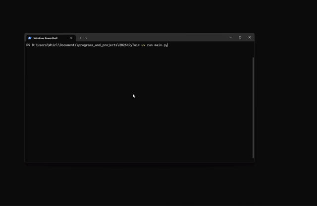

# ComprehensiveTui

This package is meant for people who hate using curses and curses-like libraries. It is widget based and similar to QT in the layout system.

This means no playing around with how individual lines draw or making sure everything sizes perfectly.
This library will attempt to handle it for you. Where it can't- functionality can be easily added by you for your particular needs.

# Demo



# Example (blocking render loop)

```python
from comprehensivetui.widgets import Program, TextBoard, Frame, Label
from comprehensivetui.events import ResizeEvent
from comprehensivetui.layouts import HorizontalLayout, VerticalLayout

class ExampleProgram(Program):
    __slots__ = ()

    def __init__(self, *args, **kwargs):
        super().__init__(*args, **kwargs)

        board = TextBoard(Align.center)
        board.lines = [str(i) for i in range(35)]

        self.set_children(
            [
                Frame(
                    [
                        Label(f"{CYAN}Test1", Align.center, name="1"),
                        Label(f"{CYAN}Test2", Align.center, name="2"),
                        Label(f"{CYAN}Test3", Align.center, name="3"),
                    ],
                    HorizontalLayout(),
                    name="Bar",
                ),
                Label(f"{CYAN}Test1", Align.center, name="4"),
                Frame(
                    [
                        Label(f"{CYAN}foo", Align.center, name="1"),
                        Label(f"{CYAN}bar", Align.center, name="2"),
                        Label(f"{CYAN}baz", Align.center, name="3"),
                    ],
                    HorizontalLayout(),
                    name="Bar",
                ),
                Label(f"{CYAN}Test2", Align.center, name="6"),
                board,
            ]
        )

        self.set_layout(VerticalLayout())

program = ExampleProgram(rate=60, title="Example Title")
program.start()
```

# Example (draw single widget)

```python
from comprehensivetui.widgets import Frame, Label
from comprehensivetui.events import ResizeEvent
from comprehensivetui.layouts import HorizontalLayout

import os


widget = Frame(
    [
        Label(f"{CYAN}Test1", Align.center, name="1"),
        Label(f"{CYAN}Test2", Align.center, name="2"),
        Label(f"{CYAN}Test3", Align.center, name="3"),
    ],
    HorizontalLayout(),
    name="container frame"
)

term_size = os.get_terminal_size()
resize_event = ResizeEvent(term_size.columns, term_size.lines)

frame.dispatch_event(resize_event) # tell our frame to resize

print(widget.view.to_flat(term_size.lines, term_size.columns))

```

# Included Widgets (so far)

- [x] Frame - frame holding multiple items + a layout
- [x] Border - A border you can put around any other widget.
- [x] Label - label holding some text (with line wrapping)
- [x] TextBoard - A chatroom-like scrolling text widget. Scroll is changable (-inf to 0 range)
- [x] Program - A widget with the ability to dispatch key events and overall manage TUI state.
- [x] Image - An image widget that takes any image object with a array-like interface + a palate. converts that image to colored ascii.
- [ ] Editor - A text input widget with line-wrapping and modern cursor controls (same you would find in ANY application)
- [ ] BorderGrid - Operates like a mix between a `Frame` and a `Border`. Allows for prettier/grid-like border drawing.

# Included Layouts (so far)

- [x] HorizontalLayout - lays elements out horizontally (evenly spacing if able- otherwise taking into account widget constraints)
- [x] VerticalLayout - vertical variant of the horizontal layout
- [ ] GridLayout

# Constraints

Each widget has a set of constraints. They have a minimum and maximum of both their width and height.
By default these constraint values are all set to `None` (meaning no constraint).

---

# What is `Dirty[T]`?????

The definition of `Dirty[T]` is this:

```python
type Dirty[T] = T
```

you may think to yourself, "this does nothing?!".
You are correct (kind of)!

## How is this useful

When a widget is created- it will look at all of the dirty properties and create accessors for them.
This means that when you set an attribute marked "dirty", it will automatically set your widget as "dirty".
A dirty widget is one who must be redrawn.

A widget will set itself as "clean" (`.dirty == False`) after a redraw has occured.

# I called draw and nothing happened :(

Calling `.draw()` does NOT draw the widget to the screen. Instead it draws it to it's internal `.view` object.
To get a print-able representation do `.view.to_flat(rows, columns)`. This will crop the view to the given size and concatinate the lines.
This makes it perfect for printing :)
